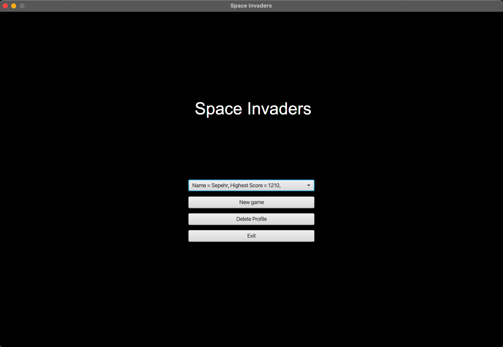
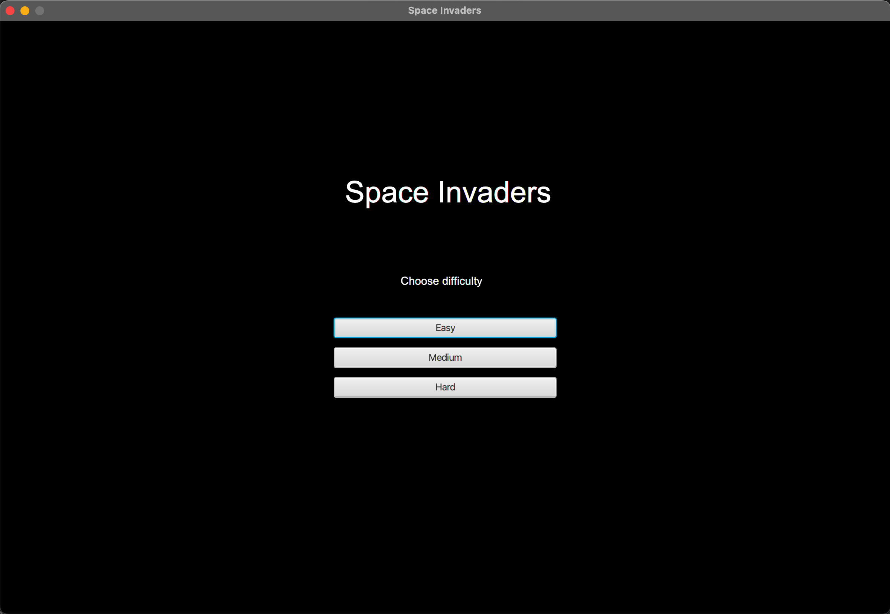
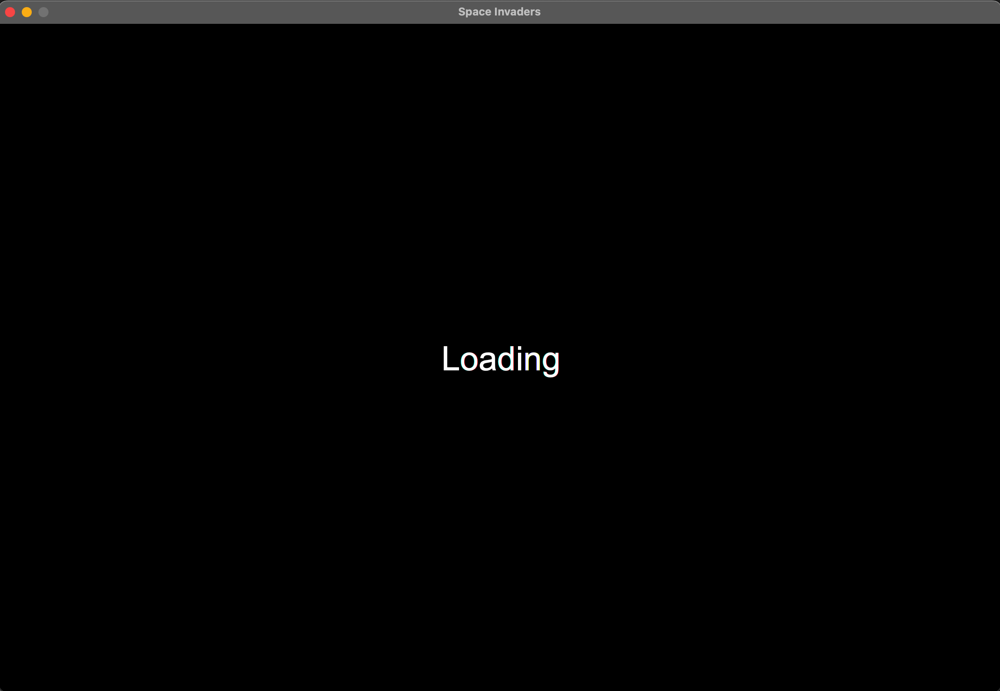
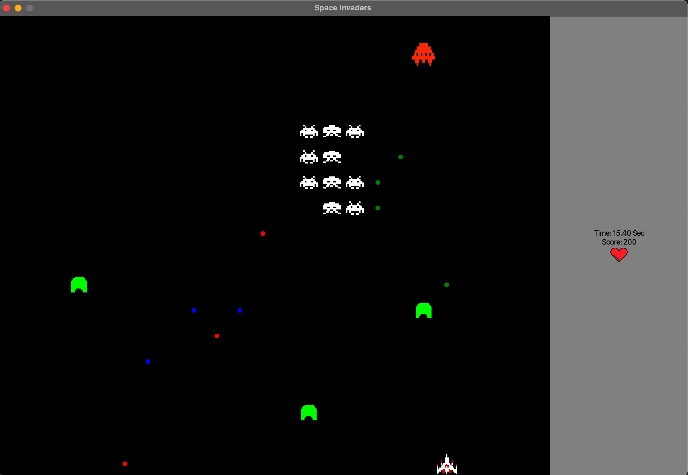
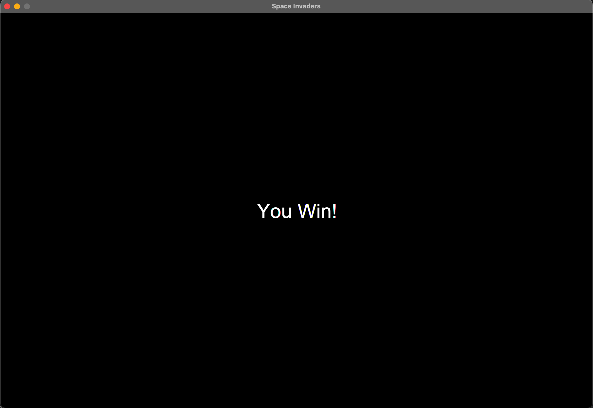

# Space Invaders

An implementation of Space Invaders using JavaFX library.

 

## Java and JavaFX version
------------
Java &nbsp; &nbsp; &nbsp; **11.0.6**

JavaFX &nbsp; **11.0.2**

 

## How to play
------------
[<kbd>&#8592;</kbd>, <kbd>&#8594;</kbd>] &nbsp; &nbsp; Move to left and right

[<kbd>Space</kbd>] &nbsp; Fire

 

## Stages
------------
### Choose Profile
In this stage, you can create new profiles or delete older ones, also the time players have spent on the game and their highest score is shown.

 

### Choose difficulty
In this stage, you can choose difficulty 😀. The health of enemies and also their shoot rate change depending on the difficulty you select. You get more points from killing enemies on harder difficulties which can help you get a higher score. 

 

### Loading Screen
Show "loading" for 3 seconds 😀.

 

### Gameplay
A player starts with 3 hearts and must kill all invaders in order to win. If the player loses all of their hearts or the invaders reach to player's spaceship, the player will lose.

There are multiple obstacles that block your bullets, but they will break if they got shot 5 times.

A UFO which is faster than invaders fly above the invaders and defeating it gives a huge amount of points.

On the right side of the screen, you can see the number of remaining hearts, the time you spend, and your current score.

 

### Win or lose
Show you won or lost for 3 seconds. 😇

