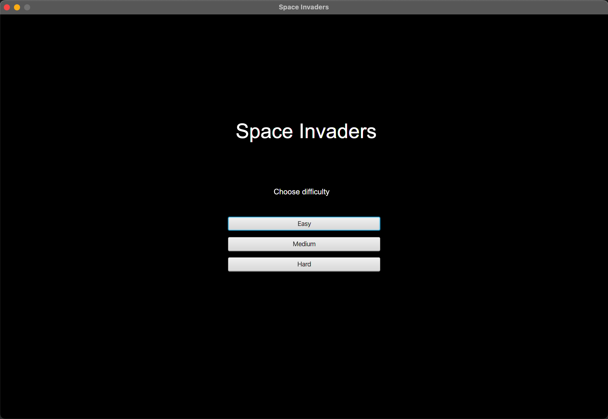
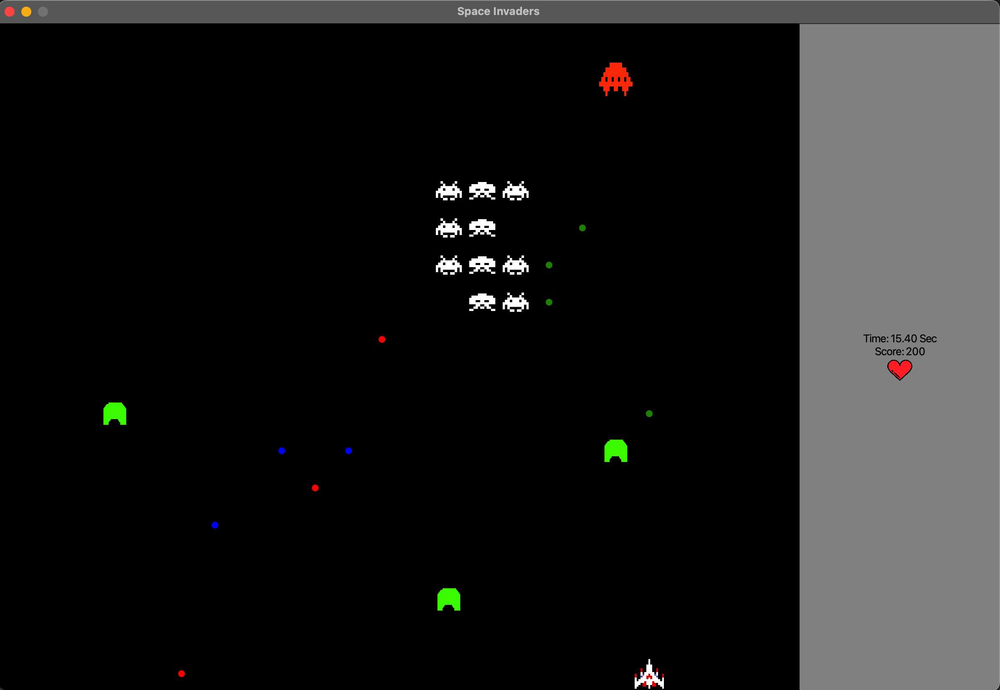

# Space Invaders

You can use the following command to run the jar file.

<pre>java --module-path ${PATH_JAVAFX_SDK}/lib --add-modules javafx.controls,javafx.fxml,javafx.swing -jar ${PATH_JAR_FILE}</pre>

Java version **11.0.6** and JavaFX version **11.0.2** was used.

## How to play

<kbd>&#8592; &nbsp; &#8594;</kbd> &nbsp; Move to left and right

<kbd>Space</kbd> &nbsp; Fire

## Stages

### Select Profile
This stage allows you to create a new profile or delete an existing one, as well as see how much time players have spent playing the game and their highest score.

### Choose difficulty
The difficulty of the game can be selected at this stage. The health of enemies and their fire rate change based on the difficulty you choose. Killing enemies on harder difficulties will earn you more points, allowing you to score higher.

### Loading Screen
Show "loading" for 3 seconds 😀.

### Gameplay
Players start with three hearts and need to kill all invaders in order to win. The player loses if they lose all of their hearts or the invaders reach their spaceship.

We have implemented a number of obstacles. They will block your bullets, but will break if they are shot five times.

A UFO, which is faster than the invaders and flies above them, have implemented too. Defeating it gives a lot of points.

On the right side of the screen, you can see the number of remaining hearts, the time you spend and your current score.

### Win or lose
Show you won or lost for 3 seconds. 😇

